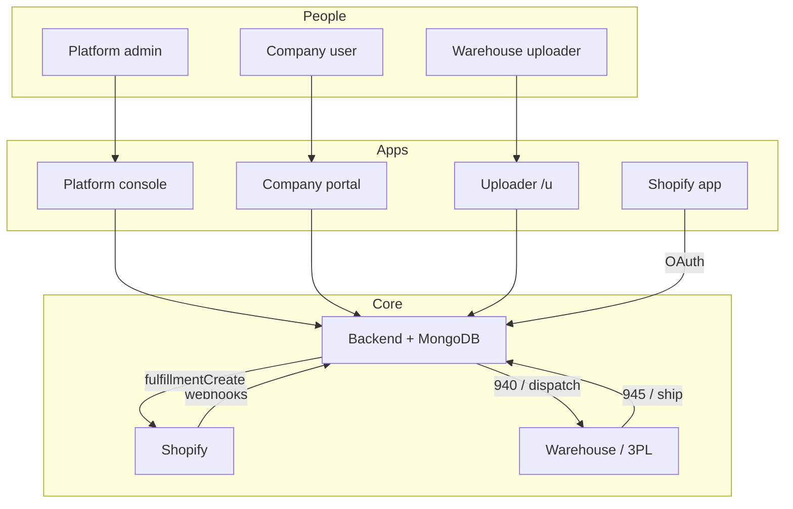
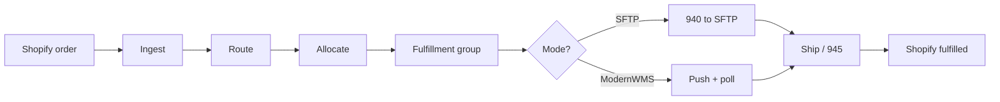
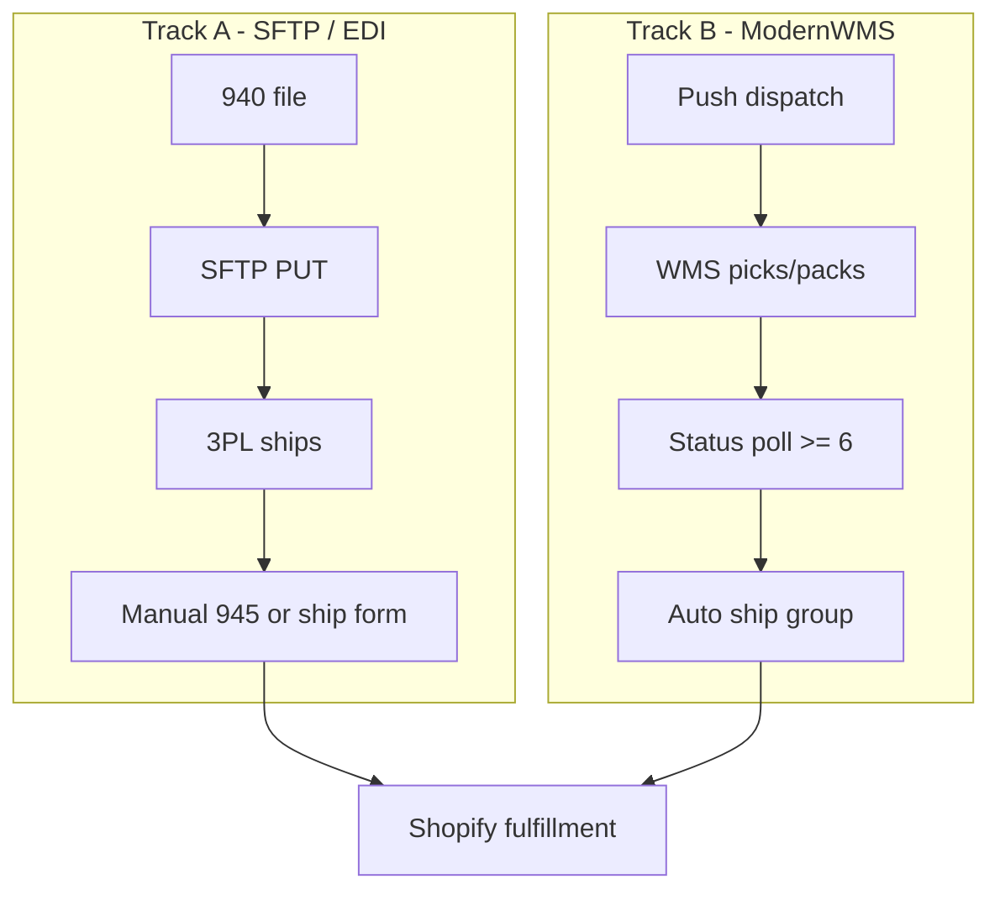
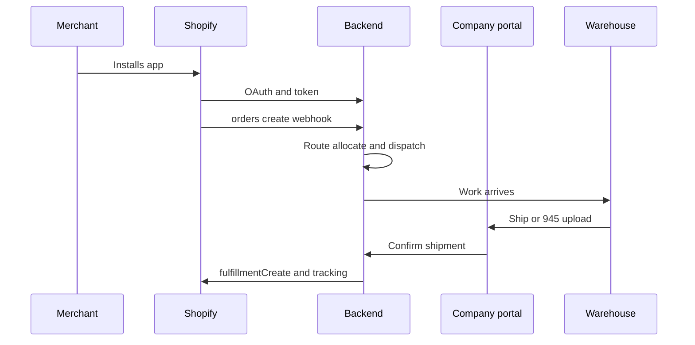

# WMS Linker — System Overview

What works today, how it flows, and how we should improve the UI.

---

## What it is

**Shopify ↔ warehouse middleware.** Orders come in from Shopify, get routed and allocated to warehouses, go out as EDI 940 / ModernWMS work, come back as shipments (945 / ship), and sync fulfillments back to Shopify.

| Piece | Role |
|-------|------|
| **Platform console** | Ops: companies, shops, kill switches |
| **Company portal** | Day-to-day: orders, routing, warehouses, team |
| **Warehouse uploader** | Limited ship / 945 upload |
| **Backend** | Source of truth (webhooks, pipeline, Shopify API) |
| **Shopify app** | Install / OAuth connector only |

---

## Working features

### Setup & access
- Multi-company tenancy (invite, signup approve/reject, soft-delete)
- JWT auth + roles (root / member / warehouse) + module RBAC
- Shopify OAuth (allowlisted shops) + HMAC webhooks
- Named SFTP connections, ModernWMS connection per warehouse

### Order pipeline
- Ingest Shopify orders → route → allocate inventory → fulfillment groups
- **Track A:** EDI 940 → SFTP (manual 945 / ship back)
- **Track B:** Push ModernWMS → poll → auto-close ship
- Sync Shopify fulfillment + tracking
- Partial fulfillments, cancel + release stock, activity logs

### Ops tools
- Failed-order DLQ (retry / reassign / skip) + alerts
- Returns (RMA receive / restock — internal, not Shopify refund; ModernWMS warehouses also ASN-putaway on restock)
- Analytics (KPIs, charts, warehouse map)
- Demo/simulate order, webhook replay, webhook kill switch
- Routing rules, ZIP / Mapbox ranking, inventory CRUD

---

## System flow

### Big picture

### Order lifecycle

### Two warehouse tracks

### Who does what

---

## UI improvement

The product logic works; the **admin / portal UI needs a real design pass**. Current UI is functional but not brand-polished or consistently designed.

### Option A — Full design in Figma, then implement

1. Designer produces screens (flows, components, states) in Figma  
2. Dev implements pixel-faithful UI from the designs  

**Best when:** you want a polished, consistent product look and clear UX for all portals.  
**Tradeoff:** more designer time and a longer design → build cycle.

### Option B — Branding only, developer builds UI

1. Designer (or brand kit) gives logo, colors, type, a few examples  
2. Dev builds layouts/components using that brand  

**Best when:** you need something better **fast**, with lighter design cost.  
**Tradeoff:** UX consistency and polish depend more on the developer; may need a later redesign.
