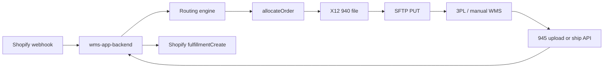
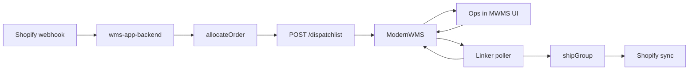

# Closed loops — wms-linker

This document describes how orders flow through wms-linker today and how **ModernWMS** fits in as the primary WMS while **SFTP/EDI** remains the legacy fallback.

Related: [`FULFILLMENT.md`](../FULFILLMENT.md), [`wms-app-backend/docs/ARCHITECTURE.md`](../wms-app-backend/docs/ARCHITECTURE.md), [`MODERNWMS.md`](MODERNWMS.md).

---

## Track A — Legacy loop (SFTP + 945)

Used when warehouse `fulfillmentMode` is **`sftp_edi`** (default).



### Steps

1. **Shopify** `orders/create` → HMAC verify → queue → [`ingestFromWebhook`](../wms-app-backend/src/modules/orders/service.js)
2. **Routing** — rules, address ranking, default/fallback ([`routing/engine.js`](../wms-app-backend/src/modules/routing/engine.js))
3. **Allocation** — reserve stock, fulfillment groups ([`fulfillment/allocate.js`](../wms-app-backend/src/modules/fulfillment/allocate.js))
4. **940** — per group ([`edi/create940`](../wms-app-backend/src/modules/edi/service.js))
5. **SFTP** — if `autoDeliverSftp` and connection configured ([`companies/sftp.js`](../wms-app-backend/src/modules/companies/sftp.js))
6. **945 inbound** — company/uploader/platform ship or upload ([`orders.apply945`](../wms-app-backend/src/modules/orders/service.js))
7. **Shopify sync** — [`shopify/fulfillment.js`](../wms-app-backend/src/modules/shopify/fulfillment.js)

### Order statuses

`received` → `940_ready` → `945_received` → `partially_fulfilled` / `fulfilled`

Errors: `error`, `on_hold`, DLQ (`PRODUCT_NOT_FOUND`, `ROUTING_NO_MATCH`, `SFTP_ERROR`, …)

---

## Routing settings matrix

Configured in company portal **Routing** (`/account/routing`).

| Routing ON | Auto-assign ON | Result |
|------------|----------------|--------|
| Yes | Yes | Auto route + commit warehouse + 940/SFTP or ModernWMS push |
| Yes | No | Suggest warehouse; user **Accept** or pick another |
| No | — | Blank warehouse until manual assign |

| No match | Fallback set | Result |
|----------|--------------|--------|
| No | Yes | Use fallback warehouse |
| No | No | `error` + `ROUTING_NO_MATCH` + notification |

---

## Track B — ModernWMS loop (primary)

Used when warehouse `fulfillmentMode` is **`modernwms`**.



### Steps

1. Same ingest + routing + allocation as Track A.
2. **940** still generated locally for audit; **SFTP skipped**.
3. **`modernwms.pushOrder`** — creates dispatch in ModernWMS; stores link `{ orderId, groupId, dispatchNo }`.
4. **Warehouse ops** complete pick/ship in ModernWMS UI (`confirm-order` → pick → `delivery`).
5. **Poller** (every `MODERNWMS_POLL_INTERVAL_MS`, default 30s) checks dispatch status.
6. When `dispatch_status >= 6`, linker calls **`shipGroup`** with `waybill_no` / `carrier` from ModernWMS → same 945/Shopify path as Track A.
7. Link marked **closed**; idempotent re-poll skips duplicate shipments.

### Per-warehouse mode

| `fulfillmentMode` | Outbound | Inbound ship confirm |
|-------------------|----------|----------------------|
| `modernwms` | REST push + poll | Automatic on delivery status |
| `sftp_edi` | 940 + SFTP | Manual 945 upload / ship API |

A single company can use **both** modes on different warehouses (split fulfillment).

---

## Admin dash visibility

| Screen | SFTP mode | ModernWMS mode |
|--------|-----------|----------------|
| Orders list | SFTP column | Awaiting MWMS / dispatch status |
| Order detail | Assign, 945 upload | MWMS banner: `dispatchNo`, status 0–7, last poll |
| Warehouses | SFTP connection | ModernWMS URL, credentials, test connection |

---

## Smoke tests

| Script | Covers |
|--------|--------|
| `scripts/routing-settings-unit-smoke.js` | Routing matrix (18 cases, memory Mongo) |
| `scripts/routing-settings-smoke.js` | Routing via HTTP |
| `scripts/945-lifecycle-cases.js` | 945 lifecycle + splits |
| `scripts/smoke-test.js` | Full API surface |
| `scripts/modernwms-closed-loop-smoke.js` | ModernWMS push + poll + legacy SFTP parallel |

Run unit routing smoke without Atlas:

```bash
cd wms-app-backend
node scripts/routing-settings-unit-smoke.js
```

Full ModernWMS smoke requires ModernWMS on port 20011 + MongoDB + backend:

```bash
MODERNWMS_BASE_URL=http://127.0.0.1:20011 node scripts/modernwms-closed-loop-smoke.js
```

Use `MOCK_MODERNWMS=1` for client/poller tests without .NET stack.

---

## Prerequisites

- MongoDB connected (Atlas or local)
- ModernWMS running with SKUs whose `bar_code` matches Shopify SKUs
- Customer / goods owner IDs configured on warehouse ModernWMS settings
- wms-backend `:3000`, admin dash `:5173`
