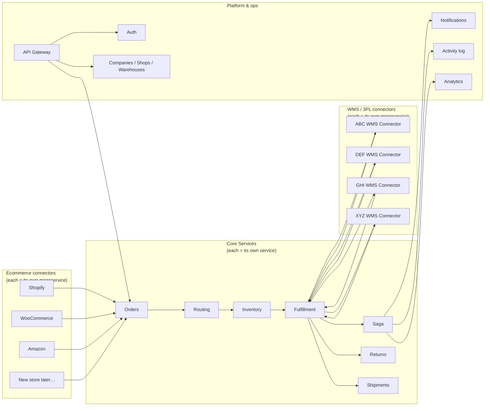
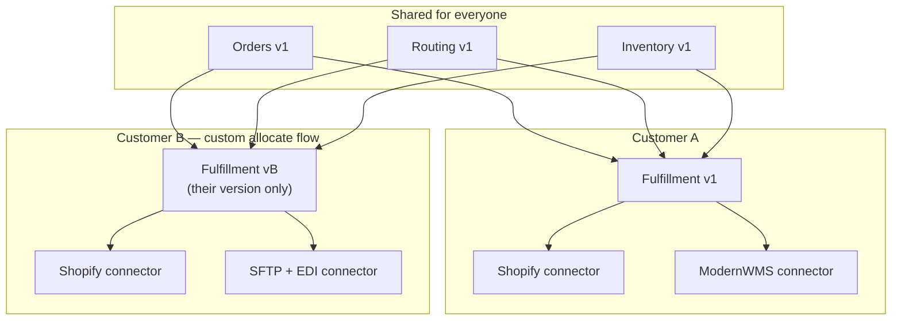

# WMS Linker — Full Microservices Plan

**Goal:** Explain that **everything** moves to microservices — not only connectors — so any customer-specific flow can be changed and deployed in isolation.

---

## The concept

We are **not** keeping a big shared “orders app” forever and only splitting connectors.

We convert **the whole backend** into microservices:

- Orders → its own microservice  
- Routing → its own microservice  
- Inventory → its own microservice  
- Fulfillment → its own microservice  
- Saga / lifecycle → its own microservice  
- Returns, shipments, companies, auth, notifications, analytics, … → each its own  
- Every ecommerce platform → its own connector microservice  
- Every WMS / 3PL → its own connector microservice  

Once that is done, if a customer needs **their own flow or module behavior**, we:

1. Change **only the microservice(s)** that need a different version for them  
2. Deploy **that customer’s version** of those services  
3. Leave every other service (and every other customer) untouched  

### Architecture diagram

**Read it like this:** stores talk to **Orders**, the core chain runs left→right, warehouses talk to **Fulfillment**. Every box above is (or becomes) a separate microservice.

---

## Why every major piece becomes a microservice

| If it stays inside one big app | If it is its own microservice |
|---|---|
| A custom change for one customer risks breaking others | Change is deployed only for that customer’s version |
| You must retest large parts of the system | You test that service + its neighbors’ contracts |
| Hard to give one customer a special module | Easy to run a customer-specific build of one module |
| One failure can take down many features | Failure stays inside that service |

Connectors are important — but they are **not** the only thing we split. Core modules like **Orders, Routing, Inventory, Fulfillment** must also be microservices so we can customize or scale them independently when a deal requires it.

---

## Full service list (all become microservices)

### Order & warehouse engine

| Microservice | Responsibility |
|---|---|
| **Orders** | Store and manage orders; accept standard order payloads from store connectors |
| **Routing** | Decide which warehouse gets the order |
| **Inventory** | Stock levels, reserve / release |
| **Fulfillment** | Allocation, warehouse paths, ask WMS to ship |
| **Saga** | Order lifecycle status machine |
| **Returns** | RMA / restock / return flow |
| **Shipments** | Tracking, carrier stages, delivery timeline |

### Account & access

| Microservice | Responsibility |
|---|---|
| **Auth** | Login, tokens, permissions |
| **Companies** | Tenants, members, company settings |
| **Warehouses** | Warehouse master data (or part of Companies if kept together initially) |
| **Shops** | Connected stores and which ecommerce connector they use |

### Platform & ops

| Microservice | Responsibility |
|---|---|
| **Notifications** | In-app + email alerts |
| **Files** | Generated documents (EDI, downloads) |
| **Activity log** | Event history on orders / ops |
| **Analytics** | Reporting dashboards |
| **Webhook intake** | Public webhook door; forwards to the right service |
| **Failed-order recovery** | Retry / clear broken ingest for support |
| **API gateway** | Single entry for apps / portals |

### Ecommerce connectors (one microservice each)

| Microservice | Example |
|---|---|
| Shopify connector | Current |
| WooCommerce connector | When needed |
| Amazon connector | When needed |
| Any new store platform | **New microservice** — does not rewrite Orders |

### WMS / 3PL connectors (one microservice each)

| Microservice | Example |
|---|---|
| ModernWMS connector | Current |
| SFTP + EDI connector | Current |
| ShipStation / ShipHero / Generic REST | When needed |
| Any new WMS | **New microservice** — does not rewrite Fulfillment |

### Carriers (later, one each as needed)

UPS / FedEx / USPS / generic tracking — each can be its own microservice used by Shipments.

---

## How customer-specific work works

### Case 1 — New ecommerce or new WMS

- Build a **new connector microservice**  
- Point that customer’s shop/warehouse at it  
- Orders, Routing, Fulfillment, etc. stay on the shared versions  

### Case 2 — Customer needs a different business flow

Examples:

- Special allocation rules  
- Different order enrichment  
- Custom return steps  
- Extra fields before dispatch  

Then:

1. Identify which microservice owns that behavior (e.g. Fulfillment, Routing, Orders)  
2. Create / maintain **their version** of that service  
3. Deploy it **only for them**  
4. Test **that service** (and its handoff to the services it talks to)  

Other services are not redeployed. Other customers keep their versions. **No ripple.**

### Isolation diagram (custom flow for one customer)

**Point of the diagram:** Customer B gets a different **Fulfillment** version. Orders / Routing / Inventory and Customer A stay as they are. Only the changed service is deployed and tested.

### Case 3 — Both

Some customers need a custom connector **and** a custom core module version. Still fine: only those two services change for them.

---

## What “no ripple” means in practice

| Change type | What we deploy | What we retest |
|---|---|---|
| New store platform | New ecommerce connector only | That connector → Orders handoff |
| New warehouse system | New WMS connector only | That connector ↔ Fulfillment handoff |
| Custom allocate logic for Customer B | Customer B’s Fulfillment (or Routing) version | That service + its contracts |
| Custom order intake for Customer C | Customer C’s Orders version (or their store connector) | That service + its contracts |

We do **not** have to regression-test the entire product for every customer tweak.

---
